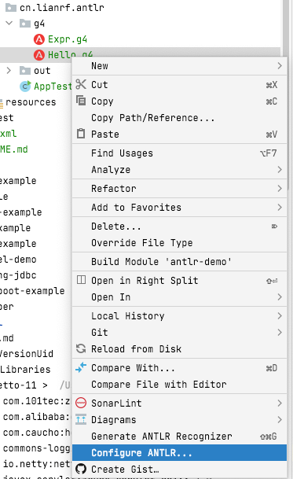
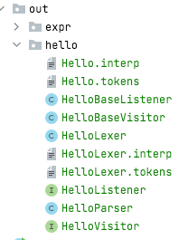

**antlr 是语法+词法分析工具，使用该工具后无需自己来实现词法分析和语法分析，只需要使用antlr的idea插件生成对应的Java代码**

如下为一个简单的数据运算g4
```g4
grammar Expr;

prog : stat+;

stat: expr NEWLINE          # printExpr
    | ID '=' expr NEWLINE   # assign
    | NEWLINE               # blank
    ;

expr: expr op=('*'|'/') expr    # MulDiv
| expr op=('+'|'-') expr        # AddSub
| INT                           # int
| ID                            # id
| '(' expr ')'                  # parens
;

MUL : '*' ; // assigns token name to '*' used above in grammar
DIV : '/' ;
ADD : '+' ;
SUB : '-' ;
ID : [a-zA-Z]+ ;
INT : [0-9]+ ;
NEWLINE:'\r'? '\n' ;
WS : [ \t]+ -> skip;
```
1.右击g4配置antlr的代码生成路径（Configure ANTLR...）  
  
2.生成词法分析和语法分析代码（Generate ANTLR Recognizer）  
  
